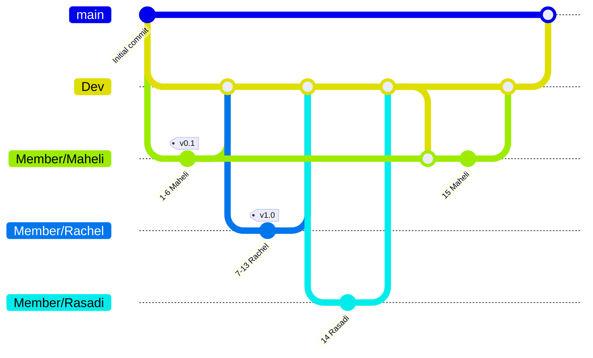

# DeadlineDesk – Assignment Deadline Tracker

ICT 2223 – 105-Minute Software Engineering Challenge

**How to run:** open `index.html` in Chrome / Edge. No install, no server, no database.

---

## Phase 1 – Define the Problem

| Question | Answer |
|---|---|
| Who is the user? | University students taking several modules at once. |
| What is the problem? | They forget assignment deadlines because deadlines are scattered across LMS pages, chats and emails. |
| What is our solution? | A small web app where a student logs in, records each assignment and instantly sees what is due next. |
| The ONE most important thing | Show the student their **upcoming deadlines, soonest first**. |

**Problem statement:**
> Our users are **university students**. They have difficulty with **remembering assignment deadlines across many subjects**. Our application will help them **record every assignment in one place and see what is due next, so nothing is missed**.

---

## Phase 2 – Kill Your Features

| MUST HAVE | NICE TO HAVE | DELETE |
|---|---|---|
| Login / register | Search by title or subject | Email / SMS reminders |
| Add assignment (title, subject, deadline, priority) | "Due in next 7 days" panel | Real database / backend server |
| Edit / delete assignment | Stats cards (total, pending, done, overdue) | File uploads for submissions |
| View upcoming deadlines (sorted) | Subject auto-suggest | Sharing with classmates |
| Mark as completed | Animations & hover effects | Calendar sync (Google Calendar) |

**MVP (if only 30 minutes were left):** Add an assignment → see it in a list sorted by deadline → mark it done. Everything else is extra.

---

## Phase 3 – Design

Full design with diagrams (architecture, user flow, sequence, data model, wireframe): **[docs/DESIGN.md](docs/DESIGN.md)**

### Architecture

```
USER  →  USER INTERFACE  →  APPLICATION LOGIC  →  DATA STORAGE
         index.html          js/app.js             js/storage.js
         css/styles.css      js/auth.js            (browser localStorage)
```

| File | Responsibility |
|---|---|
| `index.html` | Page structure: login view, dashboard, edit & delete pop-ups, SVG icons |
| `css/styles.css` | Purple colour palette, layout, animations, responsive (mobile) design |
| `js/storage.js` | **Only** file that reads/writes data. Safe JSON parsing, data validation |
| `js/auth.js` | Register, login, logout, password hashing (SHA-256) |
| `js/app.js` | Validation, add / edit / delete / complete, filtering, sorting, rendering |

### Where data is stored

No database is used. Data is saved in the browser's **localStorage** as JSON:

| Key | Contents |
|---|---|
| `dl_users` | List of users `{ username, passwordHash, createdAt }` |
| `dl_session` | Username of the logged-in user (stays logged in after refresh) |
| `dl_assignments_<username>` | That user's assignments – each user only sees their own |

Assignment record:
```json
{ "id": "lx3k9a7f2c", "title": "Report 1", "subject": "Networking",
  "deadline": "2026-10-05", "priority": "high",
  "completed": false, "createdAt": "...", "completedAt": null }
```

### Main user flow

```
Open app → Register / Login → Dashboard
   → Add assignment → validated → saved to localStorage → list re-renders (soonest first)
   → Edit / Delete (with confirmation) → saved → list re-renders
   → Tick "complete" → moves to Completed tab → stats update
   → Logout
```

### What happens on the main action ("Add assignment")
1. User fills in title, subject, deadline, priority and clicks **Add**.
2. `app.js` cleans the text (trims spaces) and **validates** it.
3. If invalid → red message + the wrong field shakes. Nothing is saved.
4. If valid → a new record with a unique id is added and `storage.js` saves it.
5. The list, stats and "next 7 days" panel are re-drawn and a toast confirms it.

---

## Phase 4 – Build: Versions (Configuration Management)

| Version | What changed |
|---|---|
| **v0.1** | Basic interface – HTML structure, purple theme, layout, icons |
| **v0.2** | Core functionality – storage layer, login, add / complete / edit / delete, upcoming list |
| **v1.0** | Working product – search, two bug fixes, test plan and demo script |

**Branching strategy**

| Branch | Purpose | Who pushes |
|---|---|---|
| `main` | Released, demo-ready versions only | Nobody directly – merged from `Dev` |
| `Dev` | Integration: everyone's finished work comes together here | Nobody directly – merged by pull request |
| `Member/Maheli`, `Member/Rachel`, `Member/Rasadi` | Each developer's own work | That member |

Flow: each member pushes to their own branch → opens a **pull request** into `Dev` → Maheli reviews and merges → when `Dev` is tested, it is merged into `main`.



Each commit is one working step:

| # | Commit | Version | By |
|---|---|---|---|
| 1 | `docs: define problem, MVP and design` | | Maheli |
| 2 | `feat(ui): build page layout, purple theme and icon set` | v0.1 | Maheli |
| 3 | `feat(storage): add localStorage data layer with safe JSON parsing` | | Maheli |
| 4 | `feat(auth): add register, login and logout with hashed passwords` | | Maheli |
| 5 | `feat(assignments): add assignments and show upcoming deadlines` | | Maheli |
| 6 | `feat(assignments): mark assignments as completed` | | Maheli |
| 7 | `feat(assignments): edit and delete with confirmation` | v0.2 | Rachel |
| 8 | `feat: add search and keep open tabs in sync` | | Rachel |
| 9 | `fix: use local time for dates (wrong day in UTC+5:30)` | | Rachel |
| 10 | `fix: refresh list after delete when animations are off` | | Rachel |
| 11 | `docs: add test plan and 90-second demo script` | | Rachel |
| 12 | `fix(ui): hide dropdown arrow on subject field` | | Rachel |
| 13 | `chore: rename app to DeadlineDesk to match the repo` | v1.0 | Rachel |
| 14 | `docs(design): add UI style guide` | | Rasadi |
| 15 | `docs: add team roles, branching strategy and pre-demo checklist` | | Maheli |

**What changed between versions**
- **v0.1 → v0.2:** the static screens became a working app – data storage, login, and the full add → view upcoming → complete → edit/delete journey.
- **v0.2 → v1.0:** search, two bugs found in testing and fixed, UI polish, the test plan and the final name.

Run `git log --oneline` to see the commits.

---

## Phase 5 – Customer Change Request

_Fill in during the challenge:_

- **Requested change:** …
- **Part of the system affected:** …
- **What could break:** …
- **Decision / how we implemented it:** …
- **Tested by:** Nimna (QA tester)

> Why the change should be easy: data access is isolated in `storage.js` and all validation is in one function (`validateAssignment` in `app.js`). Adding a new field (e.g. "notes" or "marks %") only needs: one input in `index.html`, one rule in `validateAssignment`, and one cell in `rowHTML`.

---

## Phase 6 – Break Your Own Software (Test Plan)

**Tester:** Nimna – tried to break the app with the cases below; developers fixed what failed, then Nimna re-tested.

| # | Test | Input | Expected result | Pass / Fail |
|---|---|---|---|---|
| 1 | Valid input | "Report 1", "Networking", date in 4 days, High | Added, appears in list sorted by date, toast shown | Pass |
| 2 | Missing / empty input | Empty title, or subject of only spaces | "Please enter …" error, nothing saved | Pass |
| 3 | Invalid input – past date | Deadline 2 days ago | "The deadline cannot be in the past." | Pass |
| 4 | Invalid input – far future | Deadline in year 2029+ | "Deadline must be within 2 years." | Pass |
| 5 | Invalid input – HTML/script | Title `` | Shown as plain text, no script runs | Pass |
| 6 | Repeated operation – duplicate | Same title + subject again (any case) | "This assignment already exists…" | Pass |
| 7 | Repeated operation – toggle | Mark complete, then undo, repeatedly | Status and stats update correctly each time | Pass |
| 8 | Main user flow | Register → add → edit → complete → delete → logout → login | Data still there after login / refresh | Pass |
| 9 | Login – wrong password | Correct user, wrong password | "Incorrect username or password." | Pass |
| 10 | Register – rules | Name with spaces / password < 6 / mismatch / taken name | Clear error for each | Pass |
| 11 | Corrupted storage | Broken JSON in localStorage | App still loads (falls back to empty list) | Pass |
| 12 | Edit into a duplicate | Rename an item to match another | Duplicate error, nothing changed | Pass |
| 13 | Animations turned off | Windows "reduce motion" on, then delete an item | Row disappears, stats update, toast closes | Fail → fixed → Pass |

**Bug 1 we found and fixed (test 13):** after deleting, the list only refreshed when the slide-out animation sent an `animationend` event. With animations turned off (reduced-motion setting or a background tab) that event never fires, so the deleted row stayed on screen and toasts never closed. We now use a short timer instead.

**Bug 2 we found and fixed:** "today" was calculated with `toISOString()`, which returns the **UTC** date. In Sri Lanka (UTC+5:30), between 00:00 and 05:30 that is still yesterday, so a deadline due today showed "Due tomorrow" and yesterday's date could still be picked. We now calculate and parse all dates in local time (`todayISO()` / `parseDate()` in `app.js`).

---

## Phase 7 – 90-Second Demo Script

**Presented by:** Nimna (demo lead). Maheli drives the laptop.

| Time | Say / Do |
|---|---|
| 0–15 s | "Our users are university students who forget assignment deadlines. DeadlineDesk keeps every deadline in one place." |
| 15–60 s | Register → add "Report 1 / Networking / High" → add "Lab 2" → show sorted Upcoming list and 7-day panel → mark Lab 2 complete → edit → delete with confirmation. Try a past date to show validation. |
| 60–75 s | "Our MVP is add → see sorted deadlines → mark done. Key engineering decision: we separated UI, logic and storage, so we can swap localStorage for a real database by changing only `storage.js`." |
| 75–90 s | "When the customer asked for ___, we changed ___ and re-tested ___." |

---

### Before the demo – checklist

- [x] We can explain the problem in one sentence.
- [x] We know who our user is (university students).
- [x] We have identified our MVP (add → see sorted deadlines → mark done).
- [x] Our core user journey works.
- [x] We have tested the application (13 test cases, 2 bugs found and fixed).
- [x] We have meaningful versions/commits (v0.1, v0.2, v1.0 tags; each developer works on their own branch and merges into `Dev` by pull request).
- [ ] We can explain what changed after the customer request.
- [x] Every team member knows what they contributed (see Team Roles).
- [ ] We can demonstrate the product in 90 seconds (rehearse once with a timer).

---

## Team Roles

| Member | Role | Responsibilities | Commits |
|---|---|---|---|
| Maheli | Lead Developer | Problem statement, architecture and design doc, page structure, storage layer, login, add assignment and mark as completed, branching strategy, reviews and merges pull requests | 1 – 6 (v0.1), 15 |
| Rachel | Developer | Edit / delete, search, fixing the bugs found in testing, final release and rename | 7 – 13 (v0.2, v1.0) |
| Rasadi | UI/UX Designer | Colour palette, layout and wireframe, icon set, hover and animation rules, mobile layout, style guide | 14 |
| Nimna | QA Tester & Demo Lead | Test plan and test runs (Phase 6), testing the customer change request, pre-demo checklist, presents the 90-second demo | – (tests and reports bugs; does not push code) |

## Engineering notes / limitations
- Passwords are hashed with SHA-256 before saving, but because this is front-end only, it is **not** real security – a production app would authenticate on a server.
- Data lives in one browser on one device; clearing browser data removes it.
