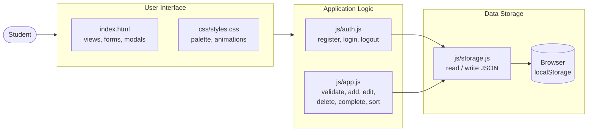
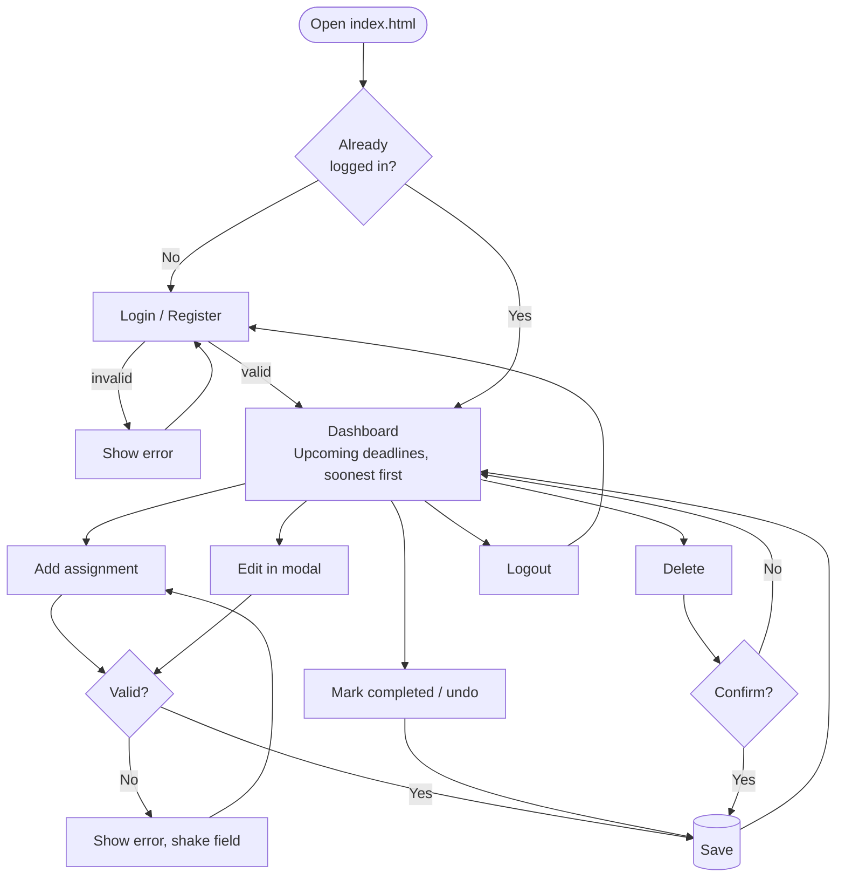
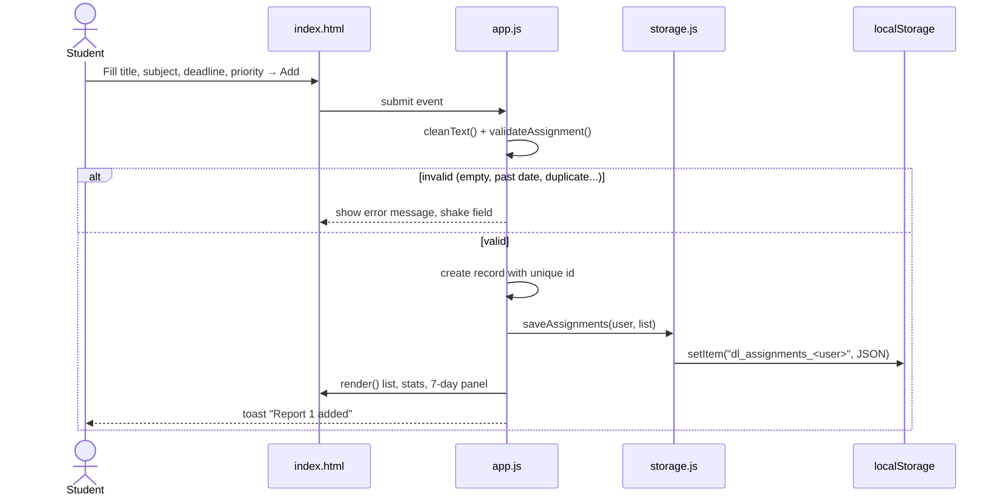
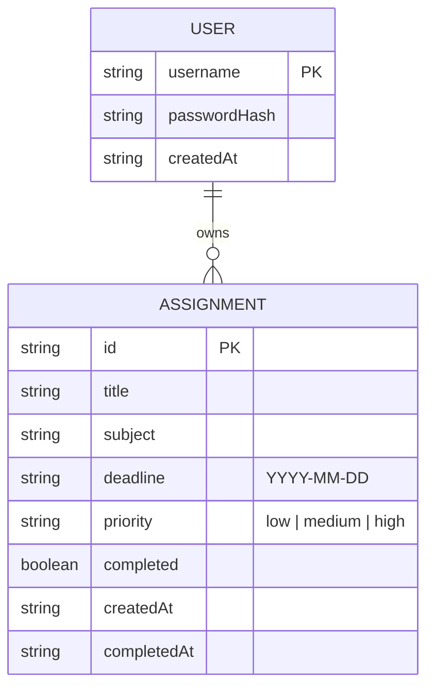
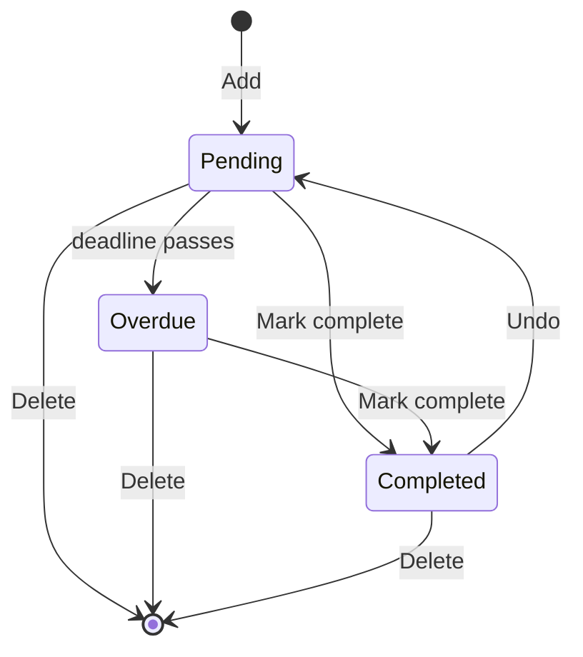

# DueSoon – Design

Phase 3 of the 105-Minute Challenge: architecture, components, data storage and user flow.

---

## 1. Architecture (layered)

We split the app into three layers. Each layer only talks to the one below it.



**Why:** the UI never touches `localStorage` directly. To move to a real database later we only rewrite `storage.js`.

---

## 2. Components

| Component | File | Responsibility |
|---|---|---|
| Login / Register view | `index.html`, `app.js` | Tabs, forms, error messages |
| Dashboard | `index.html`, `app.js` | Stats cards, add form, 7-day panel, assignment list |
| Edit modal | `index.html`, `app.js` | Pre-filled form, save changes |
| Delete modal | `index.html`, `app.js` | "Are you sure?" confirmation |
| Toasts | `app.js` | Short success / error messages |
| Validation | `app.js` → `validateAssignment()` | One place for all input rules |
| Auth service | `auth.js` | Hash password (SHA-256), check login, session |
| Storage service | `storage.js` | Safe JSON read/write, drops corrupted records |

---

## 3. Main user flow



---

## 4. What happens on the main action – "Add assignment"



---

## 5. Data model (stored as JSON in localStorage)



| localStorage key | Value |
|---|---|
| `dl_users` | array of USER |
| `dl_session` | username of the logged-in user |
| `dl_assignments_<username>` | array of ASSIGNMENT for that user |

---

## 6. Assignment status



"Overdue" is not stored. It is worked out each time from the deadline and today's date, so it is never out of date.

---

## 7. Screen layout (wireframe)

```
+---------------------------------------------------------------+
| [cap] DueSoon                              (user)  [Logout]   |
+---------------------------------------------------------------+
| [Total 4]   [Pending 3]   [Completed 1]   [Overdue 1]         |
+--------------------+------------------------------------------+
| + Add assignment   | [Upcoming] [All] [Completed]  [search..] |
| Assignment [     ] |------------------------------------------|
| Subject    [     ] | Assignment  Subject  Deadline  Pri  Stat |
| Deadline   [date ] | Quiz        Maths    Today     High Pend |
| Priority  L [M] H  | Report 1    Netw.    in 4 days High Pend |
| [ Add assignment ] | Essay       English  -3 days   Med  Over |
|--------------------|               actions: [done][edit][del] |
| Due in next 7 days |                                          |
|  Quiz      today   |                                          |
|  Report 1  4 days  |                                          |
+--------------------+------------------------------------------+
```

On phones the two columns stack, and each assignment becomes a card.

---

## 8. Key engineering decisions

| Decision | Reason |
|---|---|
| No database – use `localStorage` | Fits the 105-minute limit, no setup, works offline |
| Separate storage layer (`storage.js`) | Can swap to a real database without touching the UI |
| One `validateAssignment()` for add **and** edit | Same rules everywhere, one place to change for a change request |
| Data saved per user | Each student only sees their own assignments |
| Passwords hashed (SHA-256) | Never store plain-text passwords, even in a demo |
| Escape all user text before showing it | Stops HTML/script injection |
| Dates handled in local time | Avoids "wrong day" bugs in UTC+5:30 |
| "Overdue" calculated, not stored | Always correct without background jobs |
| Inline SVG icons | Works without internet in the lab |
